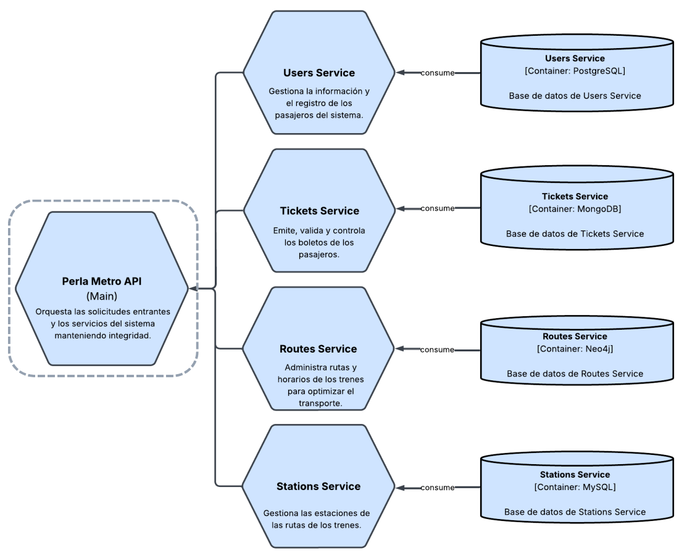

# Main API - Workshop 1 - System's Architecture

This repository contains the main API used by the **Perla Metro** system from the first workshop of the subject "Arquitectura de Sistemas" at Universidad Católica del Norte. Below are the tools used and how to setup this project locally.

## Pre-requisites

- [.NET SDK](https://dotnet.microsoft.com/es-es/download) (version 9.0.109)
- [Git](https://git-scm.com/) (version 2.49.0)
- [Docker or Docker Desktop](https://docs.docker.com/)

**Note**: This project can be setup either using the first three pre-requisites or using only Docker. It is recommended to use just **Docker**.

**Note**: Make sure to setup the services that this main API uses. There are four and can be found in the following links:

- [Users Service](https://github.com/Taller-1-Arq-de-Sistemas/perla-metro-users-service)
- [Stations Service](https://github.com/Taller-1-Arq-de-Sistemas/perla-metro-station-service)
- [Routes Service](https://github.com/Taller-1-Arq-de-Sistemas/perla-metro-routes-services)
- [Tickets Service](https://github.com/Taller-1-Arq-de-Sistemas/perla-metro-ticket-service)

Every one of them have its own README with instructions to setup the server. Follow the instructions to run these services on local and then come back to setup the main API (this just for local development or testing).

## Installation and configuration

1. **Clone the repository**

```bash
git clone https://github.com/Taller-1-Arq-de-Sistemas/perla-metro-api-main.git
```

2. **Navigate to the project directory**

```bash
cd perla-metro-api-main
```

## Setup using Docker

3.1. **Create a `.env.development` using the example environment variables file and fill its values**

```bash
cp .env.example .env.development
```

In the `.env.development` file, you can replace:

- `ASPNETCORE_ENVIRONMENT` with Development or Production. For local development keep it as `Development` (enables API docs at `/swagger`).
- `ASPNETCORE_URLS` with the port that the app use to expose the server.
- `USERS_SERVICE_URL` with the url where the users service is exposed.
- `STATIONS_SERVICE_URL` with the url where the stations service is exposed.
- `ROUTES_SERVICE_URL` with the url where the routes service is exposed.
- `TICKETS_SERVICE_URL` with the url where the tickets service is exposed.
- `JWT_SECRET` with the JWT secret that you want to use.

Once you have replaced everything, save the changes and move on to the next step.

3.2. **Build the project using docker compose**

```bash
docker compose up --build -d
```

A Docker container would be running the web app in the port **8080**

## Setup without Docker

4.1. **Restore project dependencies**

```bash
dotnet restore
```

4.2. **Initialize the user secrets**

```bash
dotnet user-secrets init
```

4.3. **Set the user secrets**

```bash

dotnet user-secrets set "JWT_SECRET" "568f60141067e2f67d755a45e6afa6cc0ae70fb5c687cc7a846a2d38baf678f9"
dotnet user-secrets set "USERS_SERVICE_URL" "http://localhost:3010"
dotnet user-secrets set "STATIONS_SERVICE_URL" "http://localhost:3011"
dotnet user-secrets set "ROUTES_SERVICE_URL" "http://localhost:3012"
dotnet user-secrets set "TICKETS_SERVICE_URL" "http://localhost:3013"
```

**Note (secret values)**: You can change these values to whatever you want, just make sure that these values match to the values in the entire system (like the JWT secret).

4.4 **Run the project**

```bash
dotnet run
```

The server will start on the configured URL (e.g., **8080**). Access the API via http://localhost:8080.

## Operations

The operations that this application expose are 7 and are separated in four modules: the users module, the stations module, the routes module and the tickets module. Below is a detailed overview of these operations:

### Users module

In this module we have 7 operations:

- **Register**: This endpoint allows to any user to register in the system as a passenger user. Its specification is like this:

  - URI: auth/register
  - Type: POST
  - Input:
    - Parameters: None
    - Query parameters: None
    - Body:
      - Name: Name of the user.
      - Last names: Last names of the user.
      - Email: Email using Perla Metro domain.
      - Password: Password of the user with at least 8 characters that must include 1 upper letter, 1 lower letter, 1 number and 1 symbol.
  - Response:
    - Status code: 201 if successful.
    - Id: ID of the user.
    - Name: Name of the user.
    - Last names: Last names of the user.
    - Email: Email of the user.
    - Role: Role of the user.
    - Token: JWT created for user authentication.

- **Login**: This endpoint allows to any user registered in the system to login using its credentials. Its specification is like this:

  - URI: auth/login
  - Type: POST
  - Input:
    - Parameters: None
    - Query parameters: None
    - Body:
      - Email: Email of the user.
      - Password: Password of the user.
  - Response:
    - Status code: 200 if successful.
    - Body:
      - Token: JWT created for user authentication.

- **Create user**: This endpoint allows to only admins to register a new user in the system. Its specification is like this:

  - URI: users
  - Type: POST
  - Input:
    - Parameters: None
    - Query parameters: None
    - Body:
      - Name: Name of the user.
      - Last names: Last names of the user.
      - Email: Email using Perla Metro domain.
      - Password: Password of the user with at least 8 characters that must include 1 upper letter, 1 lower letter, 1 number and 1 symbol.
      - Role: Role of the user.
  - Response:
    - Status code: 201 if successful
    - Id: ID of the user.
    - Name: Name of the user.
    - Last names: Last names of the user.
    - Email: Email of the user.
    - Role: Role of the user.
    - Status: Status of the user.
    - Created at: Creation date of the user.

- **Get all users**: This endpoint allows to only admins to get all the users in the system. Its specification is like this:

  - URI: users
  - Type: GET
  - Input:
    - Parameters: None
    - Query parameters:
      - Name: Full or partial name of users.
      - Email: Full or partial email address.
      - Status: One of `active` (default), `deleted`, or `all`.
    - Body: None
  - Response: A set of users that includes:
    - Status code: 200 if successful.
    - Id: Id of a user.
    - Full name: Full name of a user.
    - Email: Email of a user.
    - Status: Status of a user.
    - Created at: Creation date of a user.

- **Get a user**: This endpoint allows to only admins to get a user in the system using its ID. Its specification is like this:

  - URI: users/{**id**}
  - Type: GET
  - Input:
    - Parameters:
      - ID: ID of the user to get.
    - Query parameters: None.
    - Body: None
  - Response:
    - Status code: 200 if successful.
    - Id: Id of the user.
    - Name: Name of the user.
    - Last names: Last names of the user.
    - Email: Email of the user
    - Role: Role of the user.
    - Status: Status of the user.
    - Created at: Creation date of the user.

- **Update user**: This endpoint allows to only admins to edit an user in the system. Its specification is like this:

  - URI: users/{**id**}
  - Type: PATCH
  - Input:
    - Parameters:
      - ID: ID of the user to edit.
    - Query parameters: None
    - Body:
      - Name: Name of the user.
      - Last names: Last names of the user.
      - Email: Email using Perla Metro domain.
      - Password: Password of the user with at least 8 characters that must include 1 upper letter, 1 lower letter, 1 number and 1 symbol.
  - Response:
    - Status code: 204 if successful.

- **Delete user**: This endpoint allows to only admins to delete a user in the system (soft delete). Its specification is like this:

  - URI: users/{**id**}
  - Type: DELETE
  - Input:
    - Parameters:
      - ID: ID of the user to delete.
    - Query parameters: None
    - Body: None
  - Response:
    - Status code: 204 if successful.

### Stations module

In this module we have n operations:

### Routes module

In this module we have n operations:

### Tickets module

In this module we have n operations:

These operations with their specifications can also be checked in the URI [**swagger**](http://localhost:8080/swagger) when running in the `Development` environment. The OpenAPI JSON is available at `/openapi/v1.json`.

## System architecture

This app is a part of a SOA system mentioned in the beginning (Perla Metro). It is composed by a server made in .NET like the image shown below.



## Design patterns applied

The service uses several patterns to keep the codebase modular, testable, and maintainable:

**Layered (Controller–Service):** Separates HTTP concerns (Controllers) and application/business logic (Services). Controllers delegate to services and services makes calls to the corresponding services to handle operations.

**Dependency Injection (IoC):** All dependencies are registered and resolved via the built‑in DI container. See `AddApplicationServices` and `AddWebApp` for service lifetimes (scoped/singleton) and framework services.

**DTO (Data Transfer Object):** Public API types decouple wire contracts from domain models. Request/response DTOs live in `src/DTOs` and are validated via DataAnnotations.

**Middleware:** Cross‑cutting concerns implemented as pipeline middleware, notably `ExceptionHandlerMiddleware` to catch errors.

**Configuration via Extension Methods:** Presentation/infrastructure wiring is grouped in extension methods (`AppServiceExtensions`) to keep `Program.cs` minimal and clarify composition.

**Routing Convention:** `LowercaseParameterTransformer` enforces lowercase route tokens via `RouteTokenTransformerConvention` for consistent URLs.

## Assumptions and decisions

The implementation closely follows the workshop specification with two notable adjustments:

- All endpoints except login and register require authentication.
- The station type attribute is omitted in the stations table to simplify communication between station and route services.

## Production notes

- This service is already deployed on Render and it is accessible through this URL: https://perla-metro-api-main-v1.onrender.com.

## Authors

- [@Jairo Calcina](https://github.com/Broukt)
- [@Francisco Concha](https://github.com/Pancho-UwU)
- [@Cristhian Montoya](https://github.com/srCochayuyo)
- [@Ignacio Morales](https://github.com/Thetrolxs)
